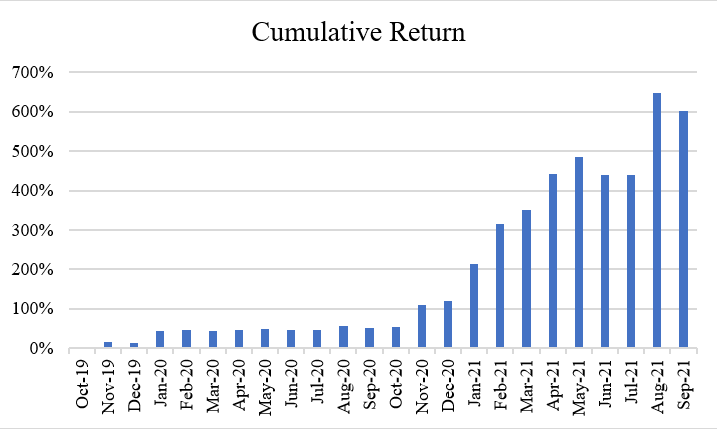

# SQR
SQR is a quantitative investment company focusing on digital assets. Our goal is to discover and operate trading strategies with minimal risk while generating high returns.

# Team
We have highly competitive members where most of whom have Ph.D. degrees in Computer Science and top-tier publications, Olympiad medals. 

# Strategies
We are operating multiple factor-based long-short hedged strategies.

# Performance
We are recording annualized Sharpe ratio of 2.14 and maximum drawdown 9.3% since inception.

# Contact
snowqr.corp at gmail.com

# Updated
2021-10-27
